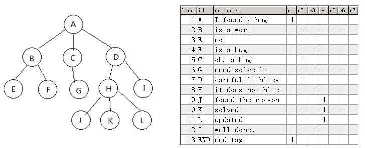
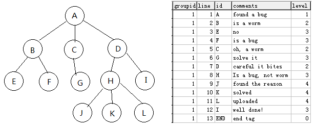
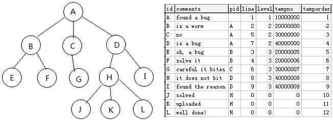

(For Chinese version please see: README-中文版)
### Multiple-Columns-Tree / Sorted-Unlimited-Depth-Tree / Sorted-Adjacency-List-Tree  
3 solutions for save hierarchical data (Tree structure) in Database  
 
Currently there are 4 common tree structure database storage patten, but they all have some problems:  
1)Adjacency List: Only record parent node. Advatage is simple, shortage is hard to access child nodes tree, need send lots SQL to database.  
2)Path Enumerations：Using a string to record path info. Advantage is easy to query, shortage is hard do insert operation, need modify lots path strings when insert a new record.  
3)Closure Table：Using another table to record path info, Advatage is easy to query and maintain, shortage is take too much space.  
4)Nested Sets：Record Left and Right Nodes, Advatange is easy to query/delete/insert, shortage is too complex.  
All of above patten has a same problem: not clearly show the whole tree structure in database.  
Here I invented 3 methods to store hierarchical data (Tree structure) in Database (Note: I'm not sure if someone else already invented these methods before because I did not spend lots time to search on internet).  

### Multiple-Columns-Tree
This method is similar like "Path Enumerations" but not exact same. I give it a name "simple multiple colums tree" because it simply use lots of database columns to store a position mark (1 or null), see below picture((https://github.com/drinkjava2/Multiple-Columns-Tree/blob/master/treemapping.jpg):


line is a sorted number record the current line (start from 1), column name is the depth of the node, "C1" means it's a root node.

To access tree from database,  using below SQL:
```
1.Query or delete all child nodes tree, for node line=X, level=cY
select *(or delete) from tb where 
  line>=X and line<(select min(line) from tb where line>X and  (cY=1 or c(Y-1)=1 or c(Y-2)=1 ... or c1=1))
For example, get D child nodes tree:
select * from tb where line>=7 and line< (select min(line) from tb where line>7 and (c2=1 or c1=1)) 
Delete D child nodes tree:
delete from tb where line>=7 and line< (select min(line) from tb where line>7 and (c2=1 or c1=1)) 

Only get direct child nodes of D:
select * from tb where line>=7 and c3=1 and line< (select min(line) from tb where line>7 and (c2=1 or c1=1)) 

2.Query root node for node line=X, level=cY:
select * from tb where line=(select max(line) from tb where line<=X and c1=1)
For example, query root node for node I:
select * from tb where line=(select max(line) from tb where line<=12 and c1=1) 

3.Query parent node for node line=X, level=cY:
select * from tb where line=(select max(line) from tb where line<X and c(Y-1)=1)
For example get parent node for node L:
select * from tb where line=(select max(line) from tb where line<11 and c3=1) 

4.Query all parent nodes for node line=X, level=cY:
select * from tb where line=(select max(line) from tb where line<X and c(Y-1)=1)
union select * from tb where line=(select max(line) from tb where line<X and c(Y-2)=1)
...
union select * from tb where line=(select max(line) from tb where line<X and c1=1)
For example, get all parent nodes for node I:
select * from tb where line=(select max(line) from tb where line<12 and c2=1)
union  select * from tb where line=(select max(line) from tb where line<12 and c1=1) 
 
5.Insert a new node, for example, insert a new node between J and K:
update tb set line=line+1 where line>=10;
insert into tb (line,id,c4) values (10,'T',1)
Note: to avoid "update tb set line=line+1" lock all table lines in a transaction, suggest add an "GroupID" 
      column to let all nodes within same root node share 1 same groupID, for example:
        update tb set line=line+1 where groupid=2 and line>=8;
        insert into tb (groupid,line,c4) values (2, 8,'T')
      By this way can improve performance, each operation in a tree will not interfere other trees.

```
Summary of "Multiple-Columns-Tree"  
Advatange:  
1. Easy understand, it's the only patten can directly see the tree structure in database.  
2. Can use very few SQL do Query, Insert, delete operation  
3. Only need 1 table  
4. Fit all type database  

Shortage:  
1. Has depth limitation because usually database allowed maximum column less than 1000, and for performance consideration, suggestion use this method within depth less than 100.  
2. Sql is very long, often need use 'c9=1 or c8=1  or c7=1 ... or c1=1'  like sql.  
3. Hard to move nodes tree. Suitable for applications only often do increase/delete, very few moving nodes operations.
4. Take too much database space  


### Sorted-Unlimited-Depth-Tree
To avoid the disadvantage of "Multiple-Columns-Tree" method, the improvement is to use only one column instead of many columns to record the depth level, by this improve now it has no limitation of depth level and much simpler than the first method, I give it a name "Sorted-Unlimited-Depth-Tree" becaue it has no depth level limitation.  See below picture
(https://github.com/drinkjava2/Multiple-Columns-Tree/blob/master/treemappingv2.png) , please note all nodes are categorized in group, each group has same groupid and with "END" tag at the end, the depth level of end tag set to "0":  

```
To access tree from database, using below SQL
1.Query or delete all child nodes tree, for node line=X, level=Y, groupid=Z:
select * from tb2 where groupID=Z and 
  line>=X and line<(select min(line) from tb where line>X and level<=Y and groupID=Z)
For example, get D child nodes tree:
select * from tb2 where groupID=1 and 
  line>=7 and line< (select min(line) from tb2 where groupid=1 and line>7 and level<=2)
Delete D child nodes tree:
delete from tb2 where groupID=1 and 
  line>=7 and line< (select min(line) from tb2 where groupid=1 and line>7 and level<=2)

Only get direct child nodes of D:
select * from tb2 where groupID=1 and 
  line>=7 and level=3 and line< (select min(line) from tb2 where groupid=1 and line>7 and level<=2) 

2.Query root node for any node with groupid=Z
select * from tb2 where groupID=Z and level=1 

3.Query parent node for node line=X, level=Y, groupid=Z:
select * from tb2 where groupID=Z and 
  line=(select max(line) from tb2 where groupID=Z and line<X and level=(Y-1))
For example get parent node for node L:
select * from tb2 where groupID=1 
  and line=(select max(line) from tb2 where groupID=1 and line<11 and level=3) 

4.Query all parent nodes for node line=X, level=Y, groupid=Z:
select * from tb2 where groupID=Z and 
  line=(select max(line) from tb2 where groupID=Z and line<X and level=(Y-1))
union select * from tb2 where groupID=Z and 
  line=(select max(line) from tb2 where groupID=Z and line<X and level=(Y-2))
...
union select * from tb2 where groupID=Z and 
  line=(select max(line) from tb2 where groupID=Z and line<X and level=1)
For example get parent node for node I:
select * from tb2 where groupID=1 and 
  line=(select max(line) from tb2 where groupID=1 and line<12 and level=2)
union  select * from tb2 where groupID=1 and 
  line=(select max(line) from tb2 where groupID=1 and line<12 and level=1)

5.Insert a new node, for example, insert a new node between J and K:
update tb2 set line=line+1 where  groupID=1 and line>=10;
insert into tb (groupid,line,id,level) values (1,10,'T',4);

6.Move node, this is little hard, for example, In MySQL, move whole B node tree to H node and between J and K:
 (Note:Need add a new column "tempno" in table, and MySql does not support Row_Number, here use a variant type) 
update tb2 set tempno=line*1000000 where groupid=1;
set @nextNodeLine=(select min(line) from tb2 where groupid=1 and line>2 and level<=2);
update tb2 set tempno=9*1000000+line, level=level+2 where groupID=1 and line>=2 and line< @nextNodeLine;
set @mycnt=0;
update tb2 set line=(@mycnt := @mycnt + 1) where groupid=1 order by tempno;
```

Summary of "Sorted-Unlimited-Depth-Tree"   
Advatange：  
1. Has no depth level limitation  
2. Simple, easy understand  
3. Easy do Sql query/delete/insert operation, Sql is much shorter and simpler than first method  
4. Only need 1 table  
5. Fit all type database  
6. Does not take much database space  

Shortage:  
1. It's a little hard to move node or child tree (but still possible, see the example6), It's best suitable for applications only often do query/insert/delete, very few moving nodes operations.  

### Sorted-Adjacency-List-Tree
To make moving/add/delete node easire, here is another mode join "Sorted-Unlimited-Depth-Tree" + "Adjacency List" together by increase 3 extra column "pid", "tempno" and "temporder", I call it "Sorted-Adjacency-List-Tree" mode, each time after node be moved (by simply changing the pid), need do a re-sort procedure. Below is an example show how to swith "Adjacency List" mode to "Sorted-Unlimited-Depth-Tree" mode by a re-sort operation:  

```
create table tb3 (
id varchar(10),
comments varchar(55),
pid varchar(10),
line integer,
level integer,
tempno bigint,
temporder integer
)

insert into tb3 (id,comments,Pid) values('A','found a bug',null);
insert into tb3 (id,comments,Pid) values('B','is a worm','A');
insert into tb3 (id,comments,Pid) values('C','no','A');
insert into tb3 (id,comments,Pid) values('D','is a bug','A');
insert into tb3 (id,comments,Pid) values('E','oh, a bug','B');
insert into tb3 (id,comments,Pid) values('F','solve it','B');
insert into tb3 (id,comments,Pid) values('G','careful it bites','C');
insert into tb3 (id,comments,Pid) values('H','it does not bit','D');
insert into tb3 (id,comments,Pid) values('I','found the reason','D');
insert into tb3 (id,comments,Pid) values('J','solved','H');
insert into tb3 (id,comments,Pid) values('K','uploaded','H');
insert into tb3 (id,comments,Pid) values('L','well done!','H');

set @mycnt=0;
update tb3 set  line=0,level=0, tempno=0, temporder=(@mycnt := @mycnt + 1) order by id;
update tb3 set level=1, line=1 where pid is null;

update tb3 set tempno=line*10000000 where line>0; 
update tb3 a, tb3 b set a.level=2, a.tempno=b.tempno+a.temporder where a.level=0 and 
a.pid=b.id and b.level=1;
set @mycnt=0;
update tb3 set line=(@mycnt := @mycnt + 1) where level>0 order by tempno;

update tb3 set tempno=line*10000000 where line>0; 
update tb3 a, tb3 b set a.level=3, a.tempno=b.tempno+a.temporder where a.level=0 and 
a.pid=b.id and b.level=2;
set @mycnt=0;
update tb3 set line=(@mycnt := @mycnt + 1) where level>0 order by tempno;

update tb3 set tempno=line*10000000 where line>0; 
update tb3 a, tb3 b set a.level=4, a.tempno=b.tempno+a.temporder where a.level=0 and 
a.pid=b.id and b.level=3;
set @mycnt=0;
update tb3 set line=(@mycnt := @mycnt + 1) where level>0 order by tempno;
```
To make the example short, I deleted the groupid column and end tag, and assume only has 1 root node.  
Advantage of "Sorted-Adjacency-List-Tree" is: easy do complicated node modification operation (add/delete/moving), easy do SQL query.  
Shortage is: Each time after did node modification operation, need make a re-sort operation, it works like make a index for database table.
